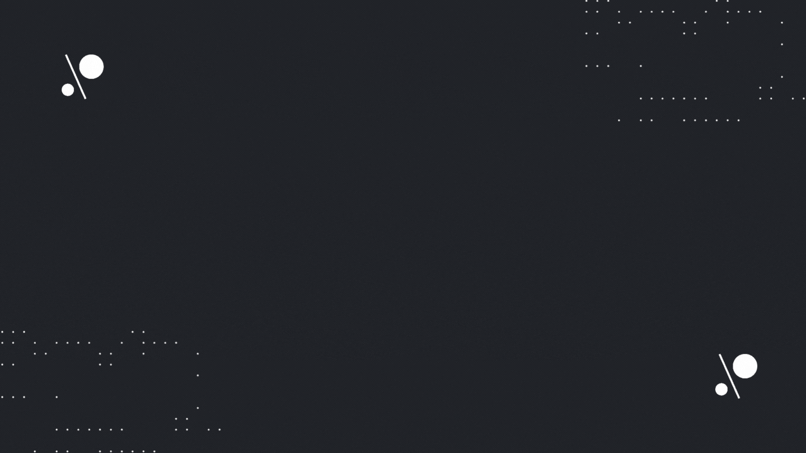

# Android Developer 
          

- 🌱 I’m currently learning Android Development 🟢
- 👯 I’m looking for mentor who can teach me mobile dev
- 🥅 2022 Goals: Learn more on Mobile Development
- ⚡ Fun fact: I can also do full-stack web dev

### Top Languages and Tools:

 

### Other Stack

